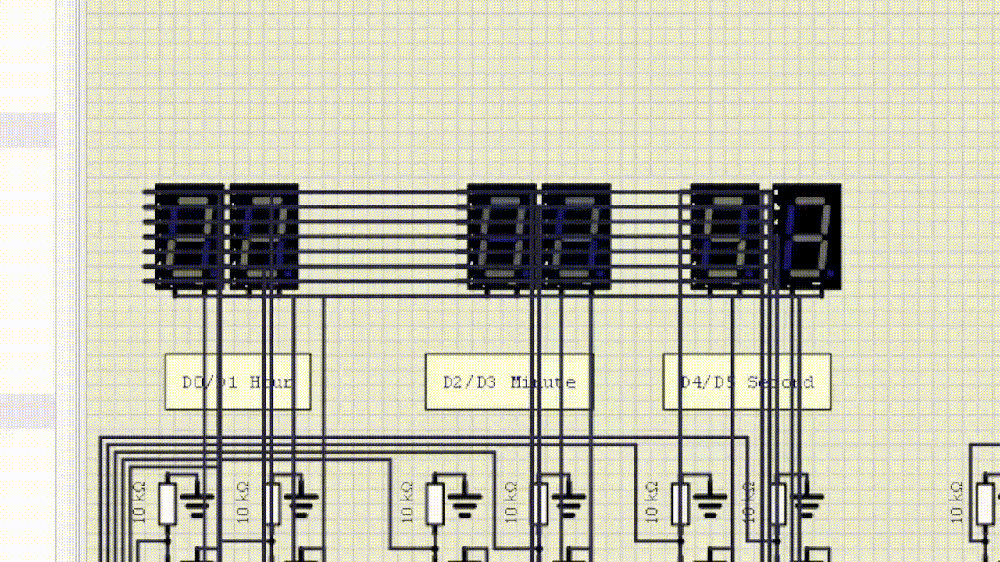
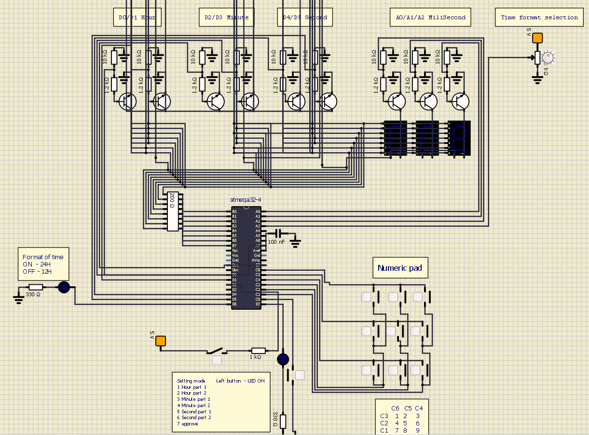

# Simple clock implementation on Atemga32

## A numeric pad is used for changing the hh/mm/ss
## Setting mode changes time after push button 7x:

for eg:
* 1 on: pad -> 1
* 1 off: 
* 2 on: pad -> 2 
* and so on ...
* 7 on
* 7 of
* New time 12:xx:xx

Time format can be changed by the potentiometer

Schematic is included in the Clock.simu

